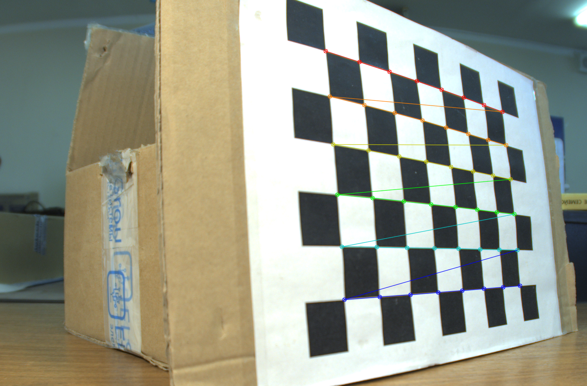

# Калибровка камеры

Репозиторий содержит скрипты для калибровки камеры и интерпретации данных.

# Содержание

Блокнот reader.ipynb читает данные из калибровочных фаилов

Фаил calibration.py нужен для запуска автоматической калибровки камеры. Для калибровки необходимо около 150 изображений. Предварительно необходимо задать размер кадой клетки на доске, количество клеток на доске, разрешение входящих изображений. 

